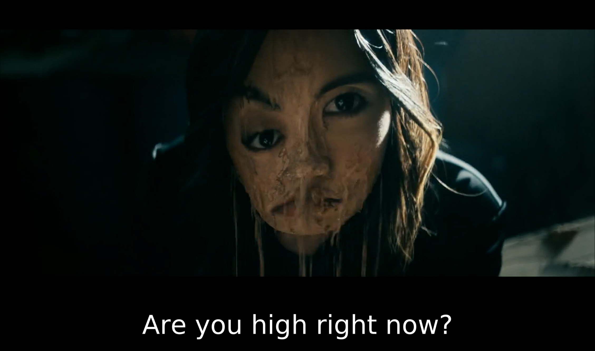

# Markdown Formatting Test

This is supposed to serve as a proof of functionality for my markdown to html converter

# This is a title

Looks good

## This is a subtitle

Also looking great

### And the illusive subsubtitle

So fine

Now let's try some more standard formatting options like perhaps **bold** text.

Or even something like **italic** text!

We supposedly have inline code support with backticks like this:

`cat somefile.md`

And an image, maybe?


Here's a list
- cats
- dogs
- fish
- pet rock

Here's another list
* milk
* eggs
* sugar
* flour
* butter

This is supposed to be a code block
```
const std = @import("std");

pub fn main() void {
    std.debug.print("Hello, world!\n", .{});
}
```

And this is a horizontal rule
---

A blockquote follows:
> Now is the time
> for all good men
> to come to the aid
> of their country.
>
> Charles Weller

And lastly a link.
[wikipedia](https://www.wikipedia.org)
