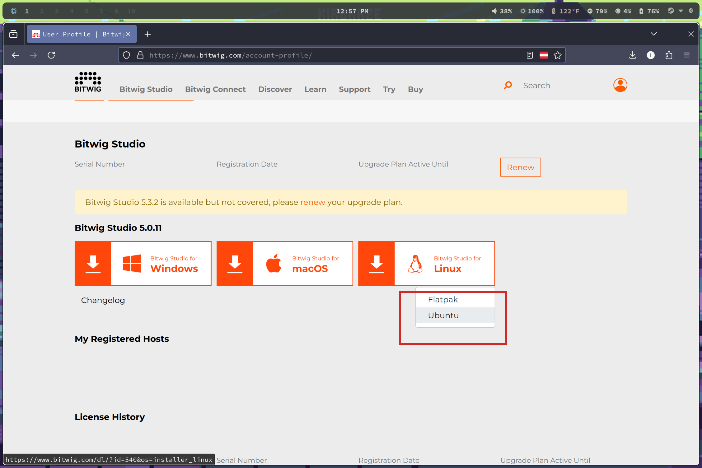
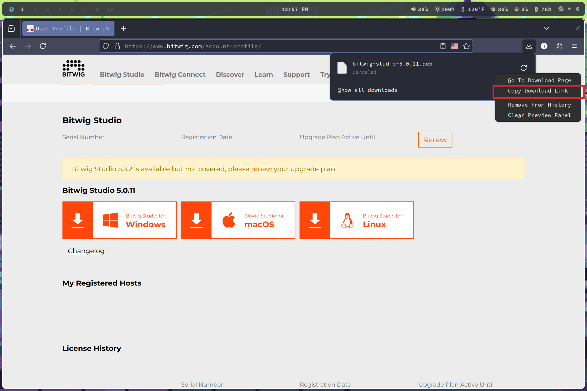
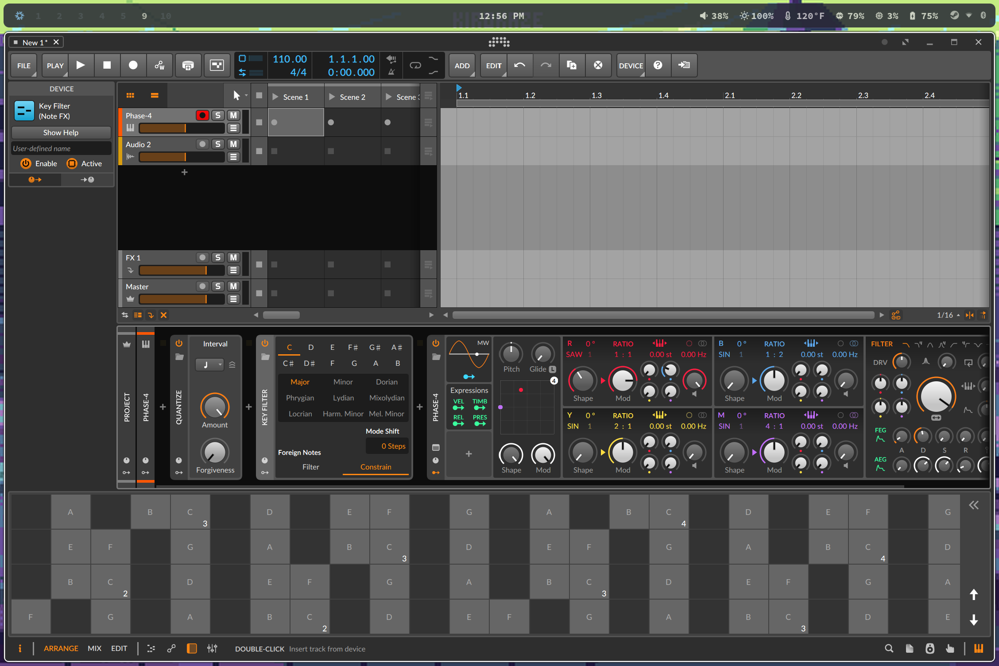

# How to install a specific version of Bitwig Studio under NixOS

If you use bitwig there's a good chance you don't continually buy the new version every time it comes out, that means that standard installation procedure is to log in via the bitwig website and then download the latest specific version that you own, that you then install on your machine.

Well for NixOS this is obviously an anti-pattern, you could perhaps use flatpaks, but if you want to do things the declarative way, the *NixOS* way, then this information is for you.

## What we're going to do (or just skip to instructions)
Nixpkgs is a collection of nix expressions for building and installing packages, bitwig-studio already has a nix expression for the (usually) latest version of bitwig, it works by downloading the .deb file provided by bitwig on their website and then building and linking the binary file, and then providing it to the users underlying system.

We are going to use a feature of Nixpkgs called overlays to override the .deb file to the *specific version* that you own, leaving the rest of the build process alone. 

So we're going to write a bitwig-studio overlay nix expression that you can import into your configuration.nix

## Instructions

Note: I'm using Firefox, if you are using Chrome the same steps apply but may have small variations.

Log into your bitwig account at [bitwig.com](https://www.bitwig.com/account-profile/)



Click the download button for Linux and select Ubuntu (this is important)


Stop the download and right click it and select "Copy download link"

If you paste it, it should look something like this:
https://downloads.bitwig.com/5.0.11/bitwig-studio-5.0.11.deb

Save this URL.

In fact, if the previous steps have given you trouble for some reason, you can probably just substitute your own version in the URL above and it'll probably work as long as bitwig doesn't change their website.

Now we're going to write our overlay.

Using your preferred editor, as root, create /etc/nixos/bitwig-overlay.nix and paste the following

```
{ config, lib, pkgs, ... }:

{
  nixpkgs.overlays = [
    (final: prev: {
      bitwig-studio = prev.bitwig-studio.overrideAttrs (oldAttrs: {
        version = "5.0.11";
        src = pkgs.fetchurl {
          url = "https://downloads.bitwig.com/5.0.11/bitwig-studio-5.0.11.deb";
          hash = "";
        };

        # Inherit the original package's meta information
        meta = oldAttrs.meta;
      });
    })
  ];
}
```

*Be sure to replace both version, and url with your own and save the file.*

Now the hash field *IS* required, but we are going to leave it blank for now because we want the nixos-rebuild command to give it to us in a moment, but first.

As root, open your /etc/nixos/configuration.nix and add the following

```
{
  imports = [
    ./bitwig-overlay.nix
  ];

  environment.systemPackages = with pkgs; [
    bitwig-studio
  ];
}
```

And then _TRY_ to rebuild your system with a standard
`sudo nixos-rebuild --switch`

Which will fail, but it will give you the *EXPECTED HASH* of the bitwig-overlay.nix saying something like the following

```
error: hash mismatch in fixed-output derivation '/nix/store/6mywmhdqc8cvvsg0q3p452nmm1nc9lv6-bitwig-studio-5.0.11.deb.drv':                                               
specified: sha256-AAAAAAAAAAAAAAAAAAAAAAAAAAAAAAAAAAAAAAAAAAA=dio-5.0.
got:    sha256-c9bRWVWCC9hLxmko6EHgxgmghrxskJP4PQf3ld2BHoY=
```

Copy the hash contents listed after got:

In my example it is `sha256-c9bRWVWCC9hLxmko6EHgxgmghrxskJP4PQf3ld2BHoY=`

And now as root replace the missing hash in /etc/nixos/bitwig-overlay.nix, in my example it now looks like this

```
{
  nixpkgs.overlays = [
    (final: prev: {
      bitwig-studio = prev.bitwig-studio.overrideAttrs (oldAttrs: {
        version = "5.0.11";
        src = pkgs.fetchurl {
          url = "https://downloads.bitwig.com/5.0.11/bitwig-studio-5.0.11.deb";
          hash = "sha256-c9bRWVWCC9hLxmko6EHgxgmghrxskJP4PQf3ld2BHoY=";
        };

        # Inherit the original package's meta information
        meta = oldAttrs.meta;
      });
    })
  ];
}
```

And finally rerun `nixos-rebuild --switch` and your system should download and build your specific version of bitwig, providing it to the underlying system.

